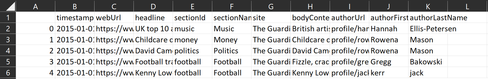
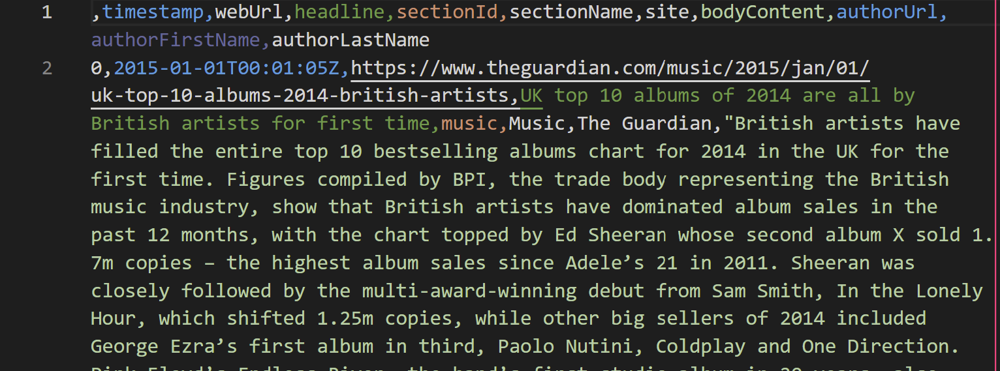

# [The Guardian](https://www.theguardian.com) News Article Collector

Collecting web articles from The Guardian
using [The Guardian Open Platform API](https://open-platform.theguardian.com/access/)
exporting into a CSV file

> Author: Faris Durrani <br/>
> GitHub: https://github.com/farisdurrani/TheGuardianArticlesCollector

## How to Use

Prerequisites:

1. Use Python 3.10
2. Install requirements in `requirements.txt`

Running:

1. Get API key
   from [The Guardian Open Platform API](https://open-platform.theguardian.com/access/)
   , putting the API key in a new `.env` file in the root directory as follows:
    ```
    API_KEY="00c0eb00-c0fe-4c1e-a312-000000"
    ```
2. Run `python main.py`
3. See the results in new CSV files written to the [`outputs/`](./outputs)
   directory

# Options

Below is one explicit option in [`main.py`](./main.py) to modify your search
preferences:

1. `START_DATES` - Since the API limits the amount of articles that can be
   collected in each call, this lists the start and end dates of each API call (
   recommended 3 months apart max). So
   the first call gets articles from dates `START_DATES[0]` to `START_DATES[1]`
   inclusive. The second call from dates `START_DATES[1]` to `START_DATES[2]`
   inclusive and so on.

# Sample Output

See a sample output in [sample_output.csv](./outputs/sample_output.csv)




# Bonus: Sentiment Analysis

The Python script [make_sentiment.py](./scripts/make_sentiment.py) uses the
[VaderSentiment](https://pypi.org/project/vaderSentiment/) library to compute
the sentiment of a CSV of strings (e.g., the body text of The Guardian articles)
and append the 4-column results to a copy of the CSV. In the script, simply:

1. Add the names of the source CSVs to analyze;
2. Modify the original directory of the source CSV filesin `ORIGINAL_SAMPLES_DIR`;
3. Modify the directory of the new CSV files in `SENTIMENTS_DIR`; and 
4. Modify the `TARGET_COLUMN` containing the target strings.

> Note: This script uses multiprocessing which makes it very fast but can be computation-heavy

See [sample_output-sentiments.csv](./scripts/sample_output-sentiments.csv) for a sample output.


# License

The Guardian News Article Collector is MIT licensed, as found in
the [LICENSE](./LICENSE) file.

The Guardian News Article Collector documentation is Creative Commons licensed,
as found in the [LICENSE-docs](./.github/LICENSE-docs) file.
